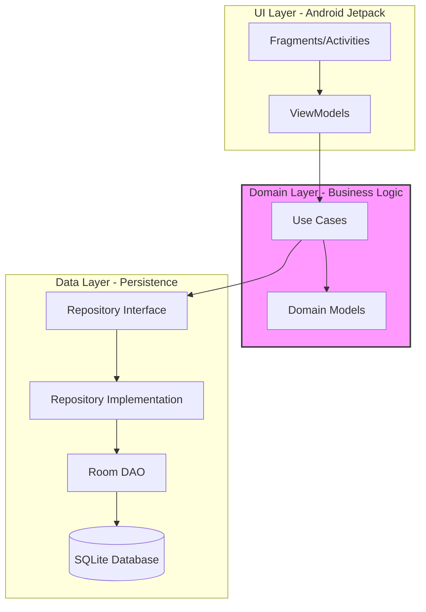
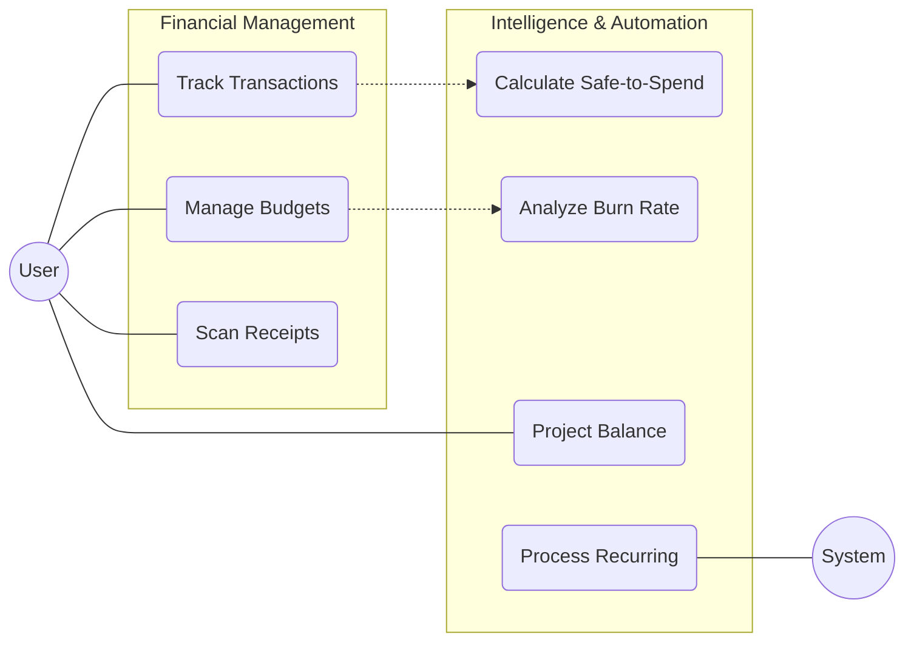
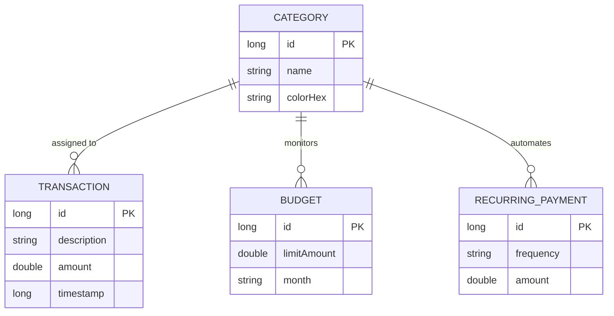
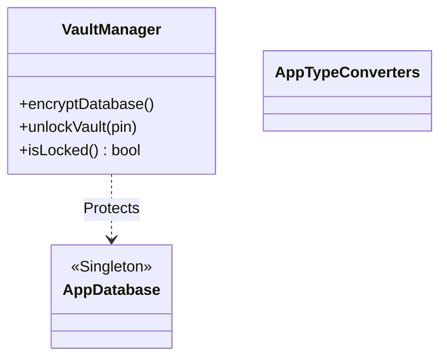

# Economiza: System Design & Architecture
*Presentation Guide for a 3-Minute Technical Deep-Dive*

---

## Slide 1: Architectural Overview
**Visual:**

**Script (45s):**
"Economiza follows **Clean Architecture** principles. We've strictly separated concerns into three layers. The **UI Layer** uses MVVM to keep the view state lifecycle-aware. The **Domain Layer** is the heart of the app—it’s pure Java logic containing our business rules and models, completely independent of Android frameworks. Finally, the **Data Layer** uses the Repository pattern to abstract our Room database, ensuring that the business logic doesn't care how the data is stored, only that it is retrieved correctly."

---

## Slide 2: Use Case Analysis
**Visual:**

**Script (45s):**
"Our system functionality is divided between **Standard Management** and **Predictive Intelligence**. Beyond basic CRUD for transactions and budgets, the architecture supports complex operations like `CalculateSafeToSpend` and `ProjectEndOfMonthBalance`. A key architectural feature is the `ProcessRecurringPayments` use case, which runs autonomously to handle subscriptions, and the `ScanReceiptUseCase` which integrates OCR capabilities into the core workflow."

---

## Slide 3: Data Schema (ER Diagram)
**Visual:**

**Script (45s):**
"The database design is centered around the **Category** entity, which acts as the relational pivot. Every transaction, budget, and recurring payment is linked to a category, allowing for powerful aggregate reporting. We use **Room ORM** with custom **TypeConverters** to handle complex financial types like `Frequency` and `Date`, ensuring high precision and data integrity across the SQLite storage."

---

## Slide 4: Security & The "Vault"
**Visual:**

**Script (45s):**
"To conclude, privacy is built into the design. The `VaultManager` component abstracts the security layer, managing database encryption and access control. This architectural decision ensures that even if the physical device is compromised, the financial 'Vault' remains encrypted. This layer sits between the Application class and the Database initialization, providing a secure gateway for all user data."
